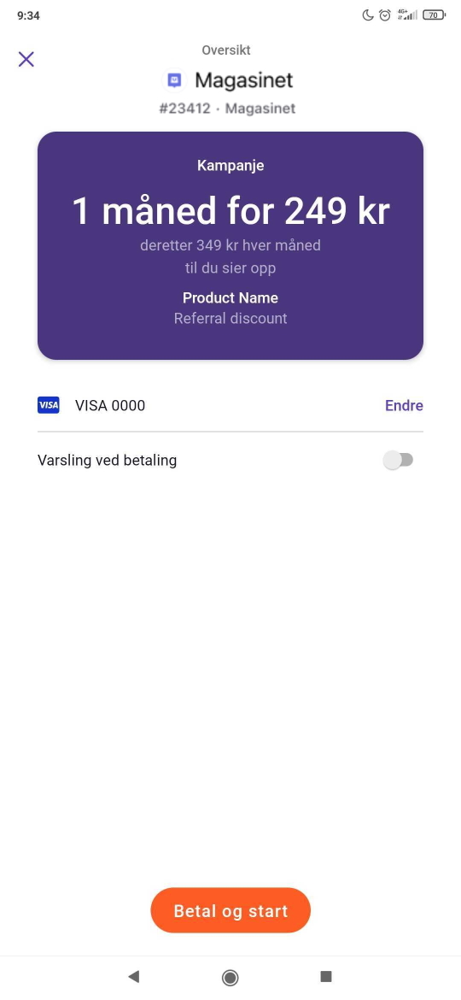
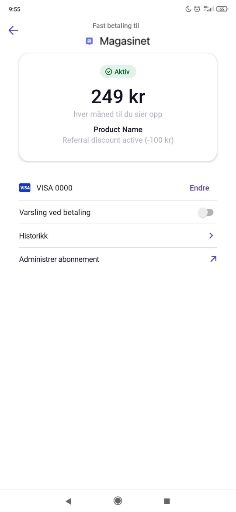
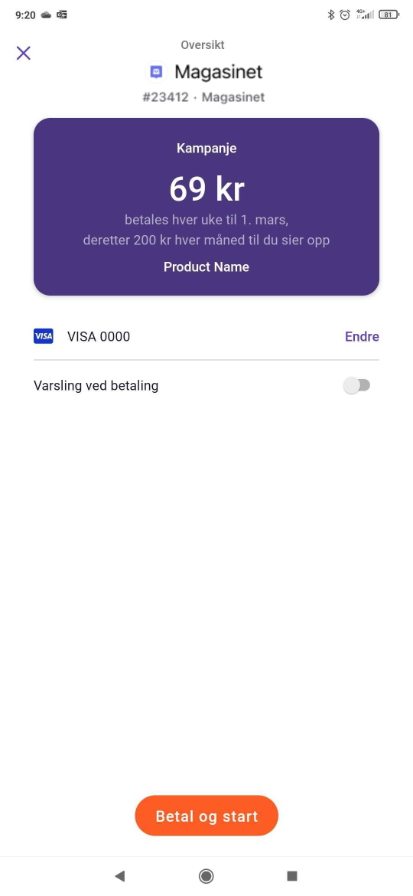

<!-- START_METADATA
---
title: Implementation inspiration
sidebar_label: Inspiration
sidebar_position: 16
description: Implementation inspiration
pagination_next: null
pagination_prev: null
---
END_METADATA -->

# Implementation inspiration

<!-- START_COMMENT -->

ℹ️ Please use the website:
[Vipps MobilePay Technical Documentation](https://vippsas.github.io/vipps-developer-docs/docs/APIs/recurring-api).

<!-- END_COMMENT -->

This page is meant to give some inspiration for how you can utilize the features of Recurring to meet a variety of needs, from special one-of agreements to referral discounts and loyalty programs.

## Unique agreements/campaigns

In Recurring, every agreement is unique, and every campaign is unique to the specific agreement they belong to. This means that you as an integrator have the ability to tailor agreements and campaigns to your individual users.
This can be used to give customers special deals on special occasions, based on referrals, etc.

## Birthday discount

If you have a user that has deactivated their subscription, and you want to give them an incentive to re-subscribe, why not give them a personalized discount?

```json
{
  ...
  "initialCharge": {
     "amount": 24900,
     "description": "Initial charge",
     "transactionType": "DIRECT_CAPTURE"
  },
  "pricing": {
    "amount": 34900,
    "currency": "NOK"
  },
  "campaign": {
    "type": "PERIOD_CAMPAIGN",
    "price": 24900,
    "period": {
      "unit": "MONTH",
      "count": 1
    }
  },
  "productDescription": "Birthday discount"
  ...
}
```


## Referrals

If you want to use referrals, you can do this in many ways. A commonly used way is to assign your users a referral code (in your systems), which new users then can enter when registering. You can then use a special campaign when drafting their agreements, like this:

[`POST:/agreements`][draft-agreement-endpoint]

```json
{
  ...
  "initialCharge": {
     "amount": 24900,
     "description": "Initial charge",
     "transactionType": "DIRECT_CAPTURE"
  },
  "pricing": {
    "amount": 34900,
    "currency": "NOK"
  },
  "campaign": {
    "type": "PERIOD_CAMPAIGN",
    "price": 24900,
    "period": {
      "unit": "MONTH",
      "count": 1
    }
  },
  "productDescription": "Referral discount"
  ...
}
```



To reward the user that referred them, you can change their agreement price and description like this:

[`PATCH:/agreements/{agreementId}`][update-agreement-patch-endpoint]

```json
{
  "productDescription": "Referral discount active (-100 kr)",
  "pricing": {
    "amount": 24900
  }
}
```



## Additional services/purchases

Sometimes your customers might want to extend their subscription with additional services or one-time purchases. For additional services that are recurring in nature, it might be apt to have separate agreements for each. For others, you might just want to change the price of the existing agreement, or even create a new agreement altogether in order to collect an initial charge to activate the additional service. An alternative to creating a new agreement is to utilize a normal ecommerce-transaction to charge your customer before altering the agreement.

## Loyalty programs

A good way to ensure customers stay is to have a good loyalty program. As with referrals, this can be achieved by using campaigns and/or updating the agreement to give a discount for loyal customers. Some scenarios:

### Reward purchasing additional services

If you want to give members a discounted subscription fee when they have purchased additional services for a certain amount,
you can achieve this by simply updating their agreement with the new pricing and a product description that explains the discount.
To remove the discount, you simply update the agreement again with the original pricing and description
*NB:* Remember to also use the new pricing when creating charges

### Reward being subscribed for an amount of time

If you want to give members a discounted subscription fee when they have been subscribed for a long time, you can do this in a couple of ways:

- Update existing agreements as previous scenario.
- Use a `FULL_FLEX_CAMPAIGN` to display to the new customers that they will get a better price if they stay subscribed. See [full flex campaign](../vipps-recurring-api.md#full-flex-campaign) for more details.

Here is an example of the latter, where they pay 69kr/week until March 1st, then 200kr/month after that:

```json
{
  ...
  "initialCharge": {
     "amount": 6900,
     "description": "Initial charge",
     "transactionType": "DIRECT_CAPTURE"
  },
  "pricing": {
    "amount": 20000,
    "currency": "NOK"
  },
  "interval": { "unit": "MONTH", "count": 1 },
  "campaign": {
    "type": "FULL_FLEX_CAMPAIGN",
    "price": 6900,
    "interval": {
      "unit": "WEEK",
      "count": 1
    }
  }
  ...
}
```



[draft-agreement-endpoint]: https://vippsas.github.io/vipps-developer-docs/api/recurring#tag/Agreement-v3-endpoints/operation/DraftAgreementV3
[fetch-agreement-endpoint]: https://vippsas.github.io/vipps-developer-docs/api/recurring#tag/Agreement-v3-endpoints/operation/FetchAgreementV3
[update-agreement-patch-endpoint]: https://vippsas.github.io/vipps-developer-docs/api/recurring#tag/Agreement-v3-endpoints/operation/UpdateAgreementPatchV3
[force-accept-agreement-endpoint]: https://vippsas.github.io/vipps-developer-docs/api/recurring#tag/Agreement-v3-endpoints/operation/acceptUsingPATCHV3
[list-charges-endpoint]: https://vippsas.github.io/vipps-developer-docs/api/recurring#tag/Charge-v3-endpoints/operation/ListChargesV3
[create-charge-endpoint]: https://vippsas.github.io/vipps-developer-docs/api/recurring#tag/Charge-v3-endpoints/operation/CreateChargeV3
[fetch-charge-endpoint]: https://vippsas.github.io/vipps-developer-docs/api/recurring#tag/Charge-v3-endpoints/operation/FetchChargeV3
[cancel-charge-endpoint]: https://vippsas.github.io/vipps-developer-docs/api/recurring#tag/Charge-v3-endpoints/operation/CancelChargeV3
[capture-charge-endpoint]: https://vippsas.github.io/vipps-developer-docs/api/recurring#tag/Charge-v3-endpoints/operation/CaptureChargeV3
[refund-charge-endpoint]: https://vippsas.github.io/vipps-developer-docs/api/recurring#tag/Charge-v3-endpoints/operation/RefundChargeV3
[userinfo-endpoint]: https://vippsas.github.io/vipps-developer-docs/api/userinfo#operation/getUserinfo
[access-token-endpoint]: https://vippsas.github.io/vipps-developer-docs/api/access-token#tag/Authorization-Service/operation/fetchAuthorizationTokenUsingPost
[vipps-test-environment]: https://vippsas.github.io/vipps-developer-docs/docs/vipps-developers/test-environment
