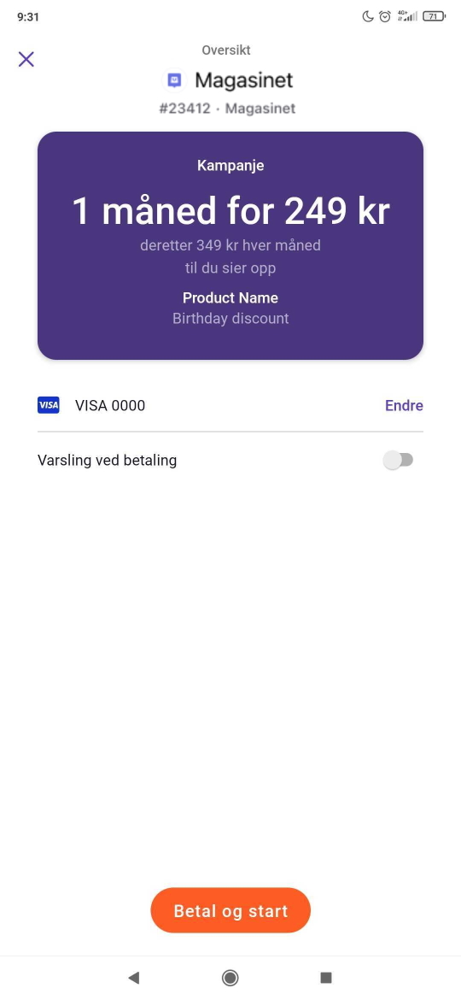

<!-- START_METADATA
---
title: How It Works - Some inspiration
sidebar_position: 13
---
END_METADATA -->

# How It Works: Some inspiration

<!-- START_COMMENT -->

ℹ️ Please use the new documentation:
[Vipps Technical Documentation](https://vippsas.github.io/vipps-developer-docs/).

<!-- END_COMMENT -->

## Introduction
This page is meant to give some inspiration for how you can utilize the features of recurring to fullfill a variety of needs, from special one-of agreements to referral discounts and loyalty programs.

## Unique agreements/campaigns
In recurring, every agreement is unique, and every campaign is unique to the specific agreement they belong to. This means that you as an integrator have the ability to taylor agreements and campaigns to your individual users.
This can be used to give customers special deals on special occations, based on referrals, etc.

## Birthday discount
If you have a user that has deactivated their subscription, and you want to give them an incentive to re-subscribe, why not give them a personalized discount?
```json
{
  ...
  "initialCharge": {
     "amount": 24900,
     "description": "Initial charge",
     "transactionType": "DIRECT_CAPTURE"
  },
  "pricing": {
    "amount": 34900,
    "currency": "NOK"
  },
  "campaign": {
    "type": "PERIOD_CAMPAIGN",
    "price": 24900,
    "period": {
      "unit": "MONTH",
      "count": 1
    }
  },
  "productDescription": "Birthday discount"
  ...
}
```


## Referrals
If you want to use referrals, you can do this in many ways. A commonly used way is to assign your users a referral-code (in your systems), which new users then can enter when registering. You can then use a special campaign when drafting their agreements, like this:
</br>[`POST:/agreements`]
```json
{
  ...
  "initialCharge": {
     "amount": 24900,
     "description": "Initial charge",
     "transactionType": "DIRECT_CAPTURE"
  },
  "pricing": {
    "amount": 34900,
    "currency": "NOK"
  },
  "campaign": {
    "type": "PERIOD_CAMPAIGN",
    "price": 24900,
    "period": {
      "unit": "MONTH",
      "count": 1
    }
  },
  "productDescription": "Referral discount"
  ...
}
```

To reward the user that referred them, you can change their agreement price and description like this:
</br>[`PATCH:/agreements/{agreementId}`]
```json
{
  "productDescription": "Referral discount active (-100 kr)",
  "pricing": {
    "amount": 24900
  }
}
```


## Additional services/purchases
Sometimes your customers might want to extend their subscription with additional services or one-time purchases. For additional services that are recurring in nature, it might be apt to have separate agreements for each. For others, you might just want to change the price of the existing agreement, or even create a new agreement alltogether in order to collect an initial charge to activate the additional service. An alternative to creating a new agreement is to utilize a normal ecommerce-transaction to charge your customer before altering the agreement.